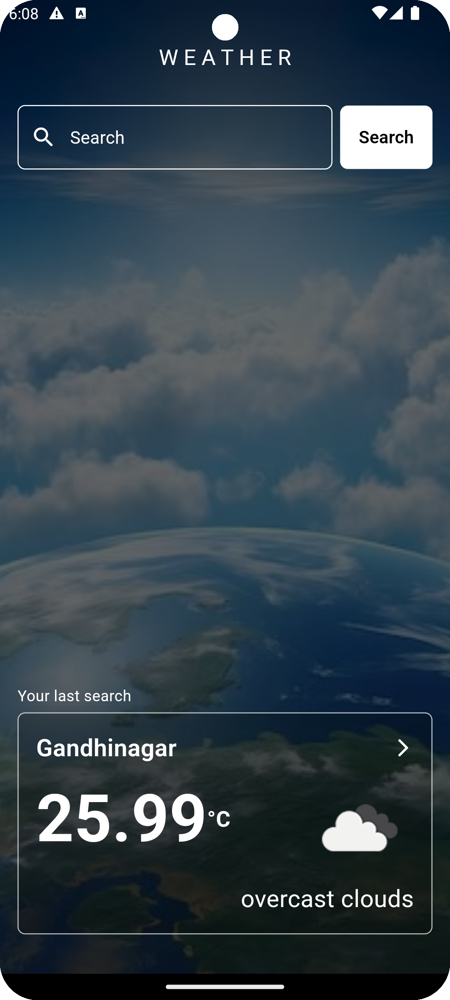
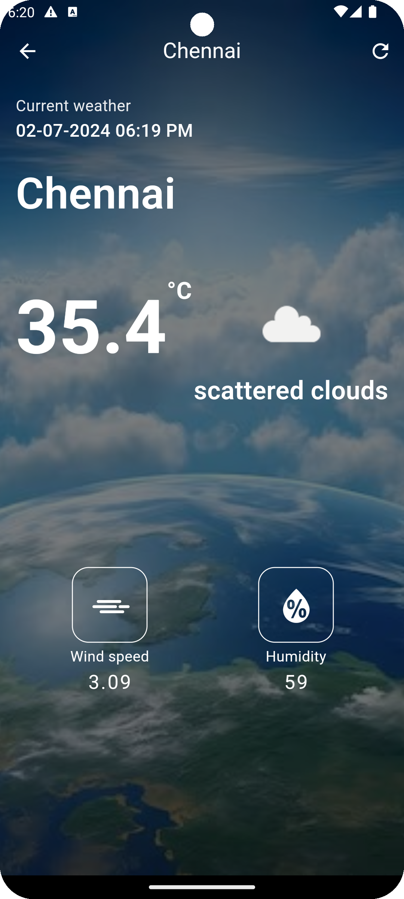

# weatherapp

A simple weather app built using Flutter that displays current weather information for a given city. The app uses the OpenWeatherMap API to fetch weather data and includes features such as a search bar, loading indicator, error handling, state management, responsive design, a refresh button, and data persistence to save the last searched city.

## Features

- Search for the current weather of any city.
- Display weather details including temperature, weather description, wind speed, and humidity.
- Show the last searched city's weather information on the home screen.
- Refresh the weather information on the detail screen.
- Responsive design for both mobile and tablet devices.
- Error handling and edge cases management.
- Loading indicators during API calls.
- Data persistence to save and load the last searched city using SharedPreferences.

## Screenshots

### Home Screen

### Weather Detail Screen

## Getting Started

### Prerequisites

- Flutter SDK: [Installation Guide](https://flutter.dev/docs/get-started/install)
- OpenWeatherMap API key: [Get your API key](https://home.openweathermap.org/users/sign_up)

1. Clone the repository:
2. Navigate to the project directory:
3. Install the dependencies
4. Insert your OpenWeatherMap API key in the `weatherServices.dart` file:

   Open `lib/resources/weatherServices.dart` and replace `your_api_key_here` with your actual OpenWeatherMap API key:

    final String apiKey = 'your_api_key_here';

### Running the App

1. Connect your device or start an emulator.
2. Run the app:
